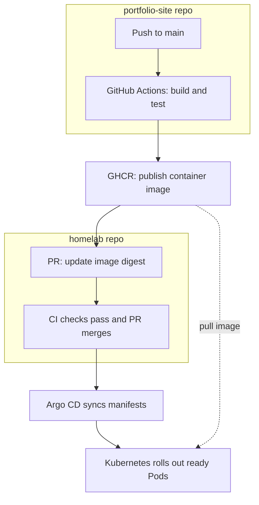
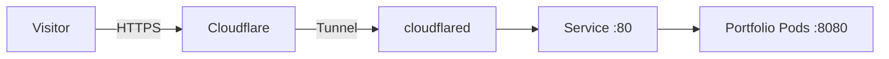

# Tolga Bilgis / Portfolio

My personal portfolio website, built with HTML, CSS, and JavaScript.

**Live:** [tolgabilgis.com](https://tolgabilgis.com)

Hosted on my three-node Kubernetes homelab, served by an unprivileged Nginx container and published through Cloudflare Tunnel with HTTPS.

GitHub Actions builds and tests the container, publishes it to GitHub Container Registry, and opens a deployment PR in my [homelab repository](https://github.com/TolgaBilgis/homelab). After checks pass and the PR automatically merges, Argo CD deploys the image pinned by digest.

## Editing and previewing

Run `python -m http.server 8080` from the repository and open `http://localhost:8080`.
The site uses local fonts and plain HTML/CSS/JavaScript. `assets/homelab-rack.jpeg`
is a web-sized copy of the lab photo from the homelab repository.

`Tolga-Bilgis-Resume.pdf` is Tolga's original supplied `TolgaRESUME09_22.pdf`,
copied without changes. Resume links open that PDF directly. `resume.html`
provides a PDF viewer and download link for visitors using the old page URL.
To update the resume, replace the PDF with a new file supplied by Tolga;
do not regenerate or rewrite it.

After changing CSS, JavaScript, or the supplied PDF, run
`python scripts/version_assets.py` and commit the updated HTML and versioned
files in `assets/`. CI checks that those URLs match their file contents.
The PDF is copied byte-for-byte. Existing versioned assets are retained so
older cached pages can still load them. Nginx requires revalidation for HTML
and stable URLs, and allows immutable caching only for versioned assets.

The site describes the completed HA, replicated storage, and restore work
confirmed by Tolga in September 2026. The homelab repository's older README
still lists those milestones as planned; its documentation needs a separate
update with implementation details. No measured recovery time is claimed.

## Delivery flow

### Website traffic

