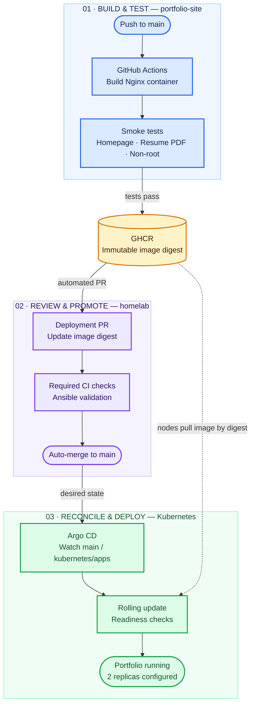
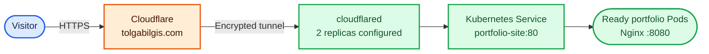

# Tolga Bilgis / Portfolio

My personal portfolio website, built with HTML, CSS, and JavaScript.

**Live:** [tolgabilgis.com](https://tolgabilgis.com)

Hosted on my three-node Kubernetes homelab, served by an unprivileged Nginx container and published through Cloudflare Tunnel with HTTPS.

GitHub Actions builds and tests the container, publishes it to GitHub Container Registry, and opens a deployment PR in my [homelab repository](https://github.com/TolgaBilgis/homelab). After checks pass and the PR automatically merges, Argo CD deploys the image pinned by digest.

## Delivery pipeline

From a source-code push to a running release. Each color marks a different part of the system.

Argo CD reads the homelab repository independently of the local checkout. It deploys the image digest recorded in Git once the deployment PR merges.

### How visitors reach the site

