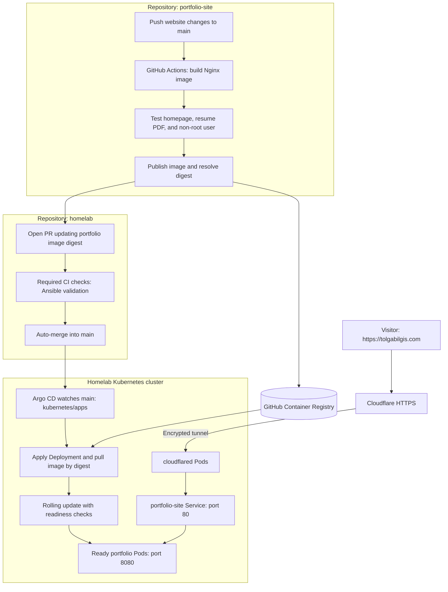

# Tolga Bilgis / Portfolio

My personal portfolio website, built with HTML, CSS, and JavaScript.

**Live:** [tolgabilgis.com](https://tolgabilgis.com)

Hosted on my three-node Kubernetes homelab, served by an unprivileged Nginx container and published through Cloudflare Tunnel with HTTPS.

GitHub Actions builds and tests the container, publishes it to GitHub Container Registry, and opens a deployment PR in my [homelab repository](https://github.com/TolgaBilgis/homelab). After checks pass and the PR automatically merges, Argo CD deploys the image pinned by digest.

## Delivery pipeline

Argo CD watches the homelab repository, not the website source or the image registry. A merged image-digest change triggers deployment; visitor traffic reaches ready Pods through the tunnel and Kubernetes Service.
